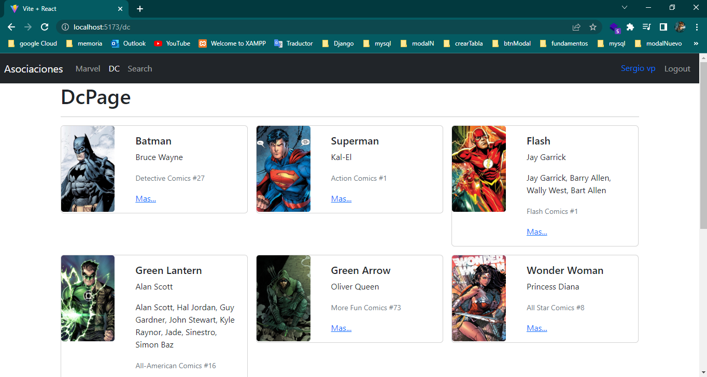
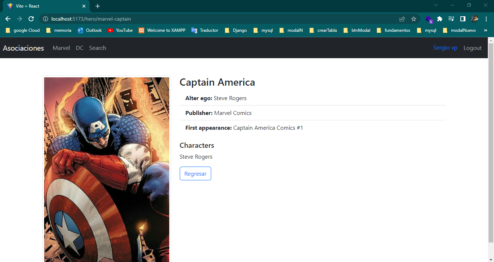
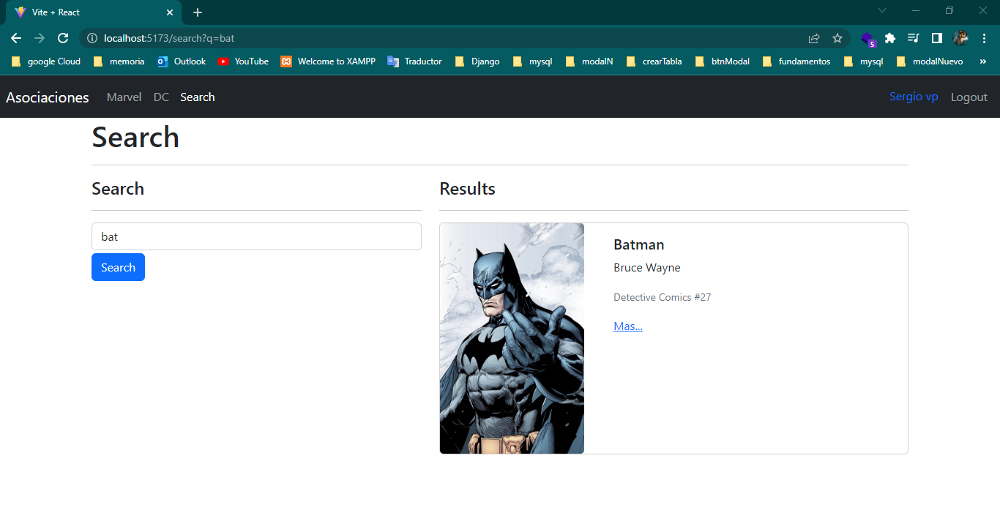
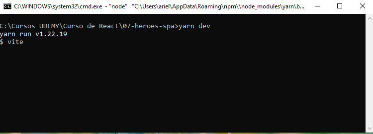

# HeroApp

Correr el comando yarn i para instalar los modulos de node 

#ACERCA DE LOS REDUCER

Los reducer estan destinados a ser funciones puras que no llaman recursos externos no llaman ninguna API externa, tienen que resolverse unicamente con el state que recibe y la accion, no deben llamar informacion que se encuentra afuera eso incluye llamar el localStorage, un fetch API.